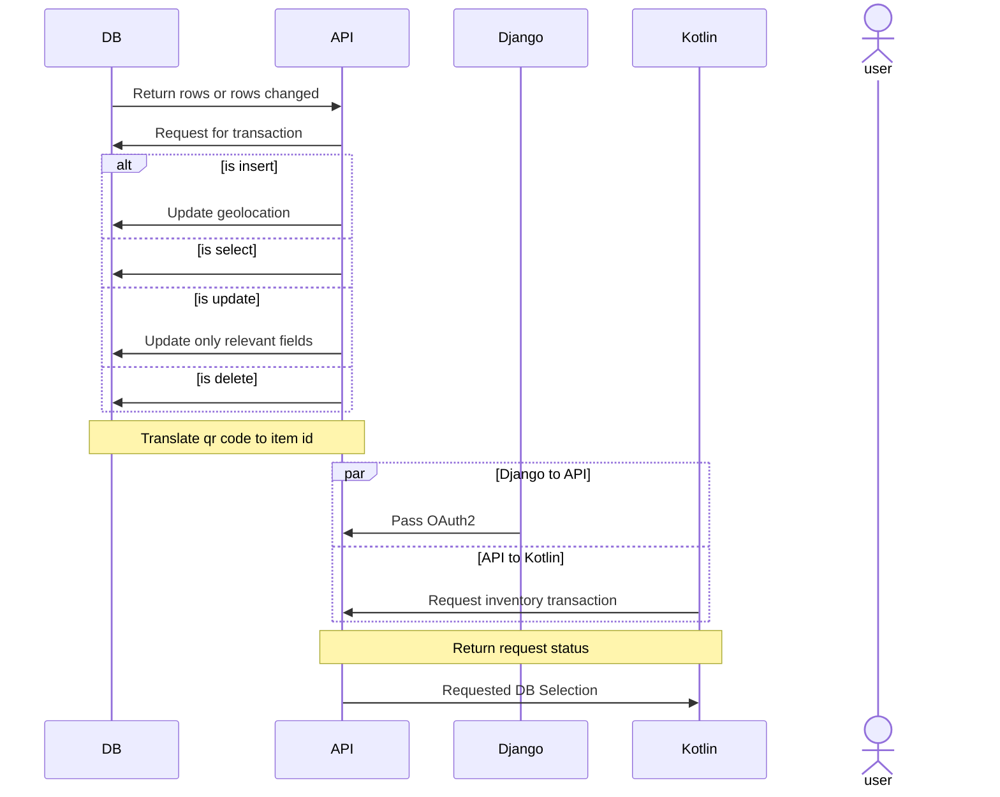

# qstars
Qstars is a mobile and desktop application to manage inventory through qr-codes.

```mermaid
sequenceDiagram
DB->>API: Return rows or rows changed
API->>DB: Request for transaction
alt is insert
    API->>DB: Update geolocation
else is select
    API->>DB: 
else is update
    API->>DB: Update only relevant fields
else is delete
    API->>DB: 
end
Note over API,DB: Translate qr code to item id
par Django to API
    Django->>API: Pass OAuth2
and API to Kotlin
    Kotlin->>API: Request inventory transaction
end
Note over Kotlin,API: Return request status
API->>Kotlin: Requested DB Selection
actor user
```